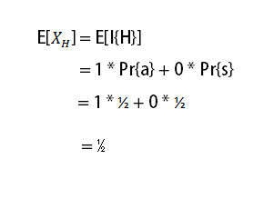
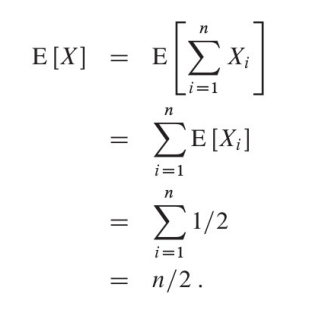

## Lanzamiento de moneda ##

### Descripción ###

El problema consiste en calcular el número esperado de veces que se podría obtener águila en n volados distintos.

###Pseudocodigo ###

	n = Total de tiradas
    
    1. Para i = 1 hasta n
    2.    tirada := random(0,1)
    3.    Si tirada == 0
    4.       regresa aguila
    5.    Si no
    6.       regresa sol
    
### Calculo probabilistico ###

**Indicador de variable aleatoria**

Nuestro espacio de prueba S = {a, s} con Pr{a} = Pr{s} = 1/2

Podemos entonces definir un indicador de variable aleatoria XH asociado con que la moneda caiga águila que es el evento H.

|XH|
|-------------|
|1 si H ocurre|
|0 si H no ocurre|

**Tiempo de ejecución promedio**

El número esperado de águilas al lanzar una moneda es simplemente el valor esperado de indicador XH

**Valor esperado**

Para encontrar el número esperado en n volados, se generaliza con la sumatoria de la posibilidad del evento de la variable aleatoria.

