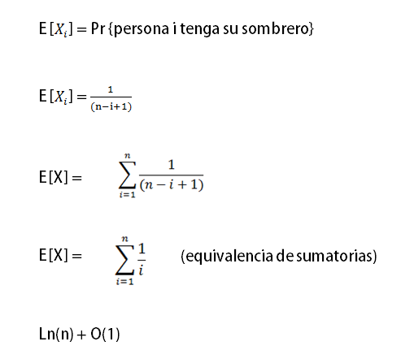

## Problema de los sombreros ##

### Descripción ###

El problema consiste en que un número n de personas dejan su sombrero a un encargado, y cuando llega el momento de irse, el encargado regresa un sombrero aleatorio a cada una de las personas. La cuestión es: ¿que número de personas se espera obtengan su sombrero que dejaron en un inicio?

###Pseudocodigo ###

	n = Total de personas y sombreros
    
	1. Total = n
    2. Para i = 1 hasta n
    3.    sombrero = sombrero aleatorio del Total
    4.    Si sombrero es de señor i
    5.       terminar
    6.    Si no
    7.       descartar sombrero del Total
    8.       Total = Total-1
    
### Calculo probabilistico ###

**Indicador de variable aleatoria**

El número de sombreros es variable para cada persona, entonces para un caso base:

**Tiempo de ejecución promedio**

Contemplando el cambio en el total de sombreros, se calcula una fórmula para poder determinar la cantidad total actual con un índice i (persona actual)

