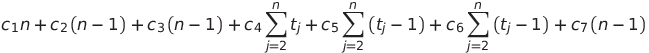
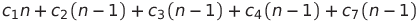
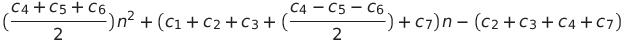

## Insertion sort ##

### Descripción ###

Es un algoritmo usado como una baraja, en el que cada que encuentra una posición a la que puede cambiar, intercambia y sigue avanzando entre las posiciones, hasta terminar de recorrer todo el arreglo y encontrarlo ordenado.

###Pseudocodigo ###

    
    1. Para j = 2 hasta Longitud de A
    2.  key = A[j]
    3.  i = j - 1
    4.  Mientras i > 0 y A[i] > key
    5.   A[i + 1] = A[i]
    6.   i = i - 1
    7.  A[i + 1] = key
    
### Orden ###

**Tiempo de ejecución**

Ci con i para linea del código, n el número de veces a ejecutarse

Ecuación general:

**Mejor caso: Arreglo ordenado**

    Con tj = 1 

**Peor caso: Arreglo inversamente ordenado**

    Con tj = j para j=2,....,n 

**Orden del algoritmo:**

