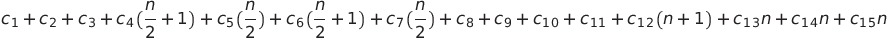
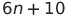
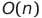

## Merge sort ##

### Descripción ###

Es un algoritmo en etapa final que procesa datos ordenados de otro algoritmo recursivo. Despues de que los datos son agrupados en arreglos ordenados entre sí mismos, merge sort se encarga de apilarlos en uno solo haciendo comparaciones simples con los topes de la pila. 

###Pseudocodigo ###

    
| Número | Linea | Costo |
| ---------- | ---------- | ---------- |
| 1   | n1 = q - p + 1  | 1   |
| 2   | n2 = r - q   | 1   |
| 3   | Sean L[1...n1+1] y R[1...n2+1] 2 arreglos | 1   |
| 4   | for i=1 hasta n1   | n/2 + 1  |
| 5   | L[i] = A[p+i-1]   | n/2   |
| 6   | for j=1 hasta n2   | n/2 + 1  |
| 7   | R[j] = A[q+j]   | n/2  |
| 8   | L[n1+1] = infinito   | 1   |
| 9   | R[n2+1] = infinito | 1   |
| 10   | i=1   | 1   |
| 11   | j=1   | 1   |
| 12   | for k=p hasta r   | n+1   |
| 13   | if(L[i] <= R[j]   | n  |
| 14  | A[k] = L[i]   | n  |
| 15  | i = i+1   | n   |
| 16  | else A[k] = R[j]  | -   |
| 17  | j = j+1 | -   |
    
### Orden ###

**Tiempo de ejecución**

Ci con i para linea del código, n el número de veces a ejecutarse

Ecuación general:

Ecuación reducida:

Ecuación final:

**Orden del algoritmo:**

