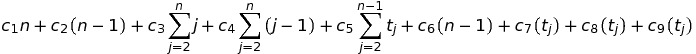
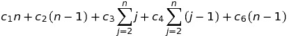
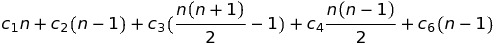
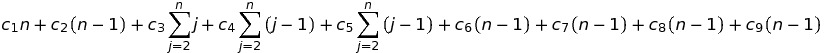
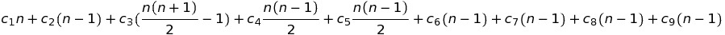
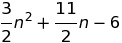

## Selection sort ##

### Descripción ###

Es un algoritmo que tiene como principio encontrar el elemento mas pequeño de cada subarreglo, mientras que en cada iteración intercambia la primera posición de este con la posición del menor. Cada subarreglo se vuelve mas pequeño hasta llegar a un arreglo de tamaño 2 en el que solo se puede hacer una última ordenación.

###Pseudocodigo ###

	n = (Longitud de A) - 1
    
    1. Para i = 1 hasta n - 1
    2.    menor := i
    3.    Para j = i+1 hasta n
    4.       Si A[j] < A[menor]
    5.         menor := j
    6.    Si i <> menor
    7.       aux := A[i]
    8.       A[i] := A[menor]
    9.       A[menor] := aux
    
### Orden ###

**Tiempo de ejecución**

Ci con i para cada linea del código, n el número de veces a ejecutarse, tj tiempo dependiente de j

Ecuación general:

**Mejor caso: Arreglo ordenado**

    Con tj = 0 (no tendria que reasignar nunca la variable 
	menor, ademas de no hacer intercambios)

**Final **

**Peor caso: Arreglo inversamente ordenado**

    Con tj = j (tiene que reasginar la variable menor el
	mayor numero de veces posible, ademas de realizar todos
	los intercambios que permite el ciclo)

**Final **

**Orden del algoritmo:**

