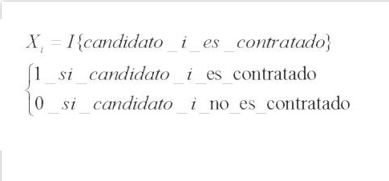
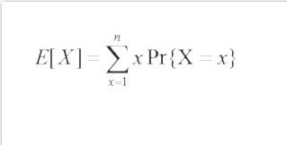
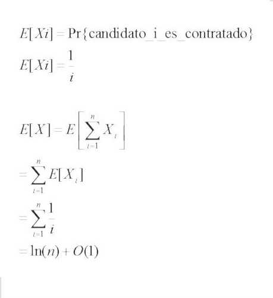

#Contratación de asistente#

##Descripción##

Se necesita contratar a un nuevo asistente de oficina. Decides contratar una agencia que te envía un candidato cada día. Decides que después de entrevistar a cada persona sólo la contratarás si el solicitantes está mejor calificado que el asistente actual.

##Pseudocódigo##

	
	 mejor = 0

	 Para i = 1 hasta n
	   entrevistar al candidato i
	   Si candidato i es mejor que candidato 'mejor'
	       mejor = i
	       contratar candidato i

##Análisis probabilístico##

Indicador de variable aleatoria

Sea **X** el número de veces que contratamos un nuevo asistente

###Tiempo de ejecución###

Sea **Xi** en el que el candidato **i** es contratado la variable aleatoria asociada con el evento

