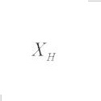
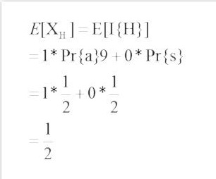
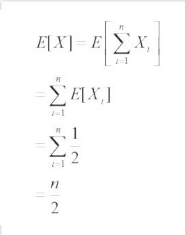

#Lanzamiento de moneda#

##Descripción##
Vamos a obtener el número de veces que se podría obtener águila, en vez de sol, en **n** lanzamientos distintos.

##Pseudocódigo##
	
	 Para i = 1 hasta n
	    tirada := random(0,1)
	    Si tirada == 0
	       regresa aguila
	    Si no
	       regresa sol

##Análisis probabilístico##

###_Indicador de variable aleatoria_###

Nuestro espacio de en el que se realizara la prueba es

 S = {a, s} con Pr{a} = Pr{s} = 1/2.

Donde el indicador de variable aleatoria
 
 

asociado con 

que la moneda caiga águila que es el evento H.

###Tiempo de ejecución promedio###

El número esperado de águilas al lanzar una moneda es simplemente el valor esperado de indicador 

###Valor esperado###

Para encontrar el número esperado en **n** volados, se generaliza con la sumatoria de la posibilidad del evento de la variable aleatoria.

