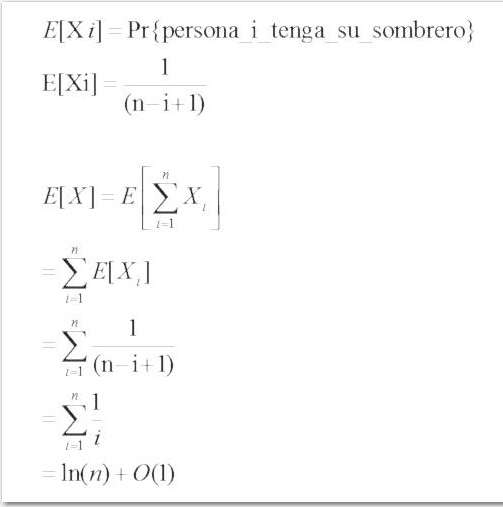

#Problema de los sombreros#

##Descripción##

El problema consiste en que un número **n** de personas dejan su sombrero a un encargado a la entrada de un restaurante, y cuando llega el momento de irse, el encargado regresa un sombrero aleatorio a cada una de las personas, ¿Cuál es la probabilidad de que el encargado regrese el sombrero correcto de las pernas que entraron?

##Pseudocódigo##
	
	
	 Total = n

	 Para i = 1 hasta n
	    sombrero = sombrero aleatorio 
	    Si sombrero es de persona i
	       cont++;
	    Sino
	       descartar sombrero del Total
	       Total = Total-1

##Análisis probabilístico##

Indicador de variable aleatoria
El número de sombreros es variable para cada persona, entonces para un caso base:

 
 
Tiempo de ejecución promedio
Contemplando el cambio en el total de sombreros, se calcula una fórmula para poder determinar la cantidad total actual con un índice **i** (persona actual)

